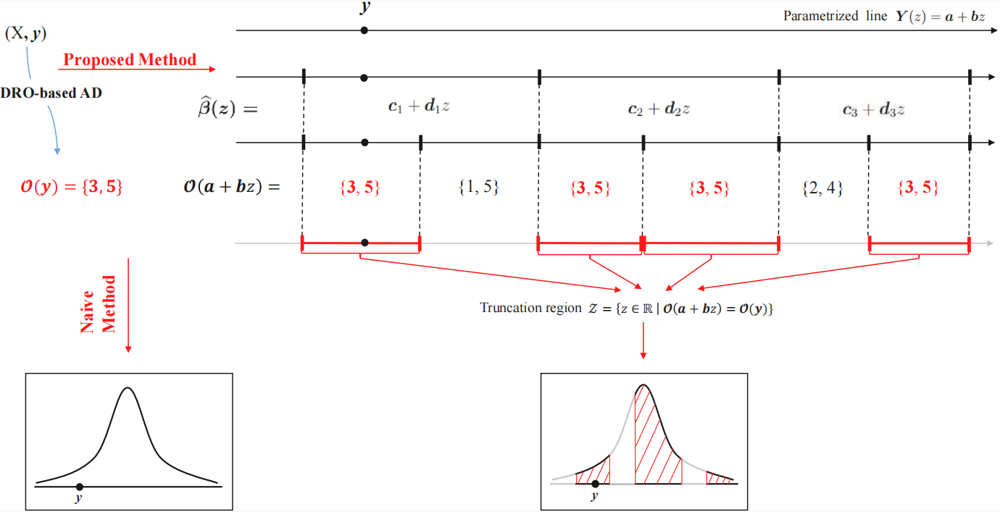

# Statistical Inference for Anomaly Detection via Distributionally Robust Optimization

This repository provides the implementation with some examples for SI-ADRO. The proposed method aims to perform a proper hypothesis testing on outliers detected by Distributionally Robust Optimization, which can control False Positive Rate (FPR) at a significance level $\alpha$. In this work, we consider the DRO problem with the ambiguity set induced by $\ell_{1}$ and $\ell_{\infty}$ Wasserstein metric.

## Method Overview 

*Figure 1: Overview of the proposed SI-ADRO method.*

To achieve controlled FPR, we need to consider the selection procedure of Wasserstein DRO when performing hypothesis testing. This selection procedure is represented by the truncation region $\mathcal{Z}$ and can be characterized by leveraging the piece-wise linear structure of Wasserstein DRO. Moreover, we develop a computationally efficient strategy to improve the true detection rate.

## Installation & Requirements

This implementation has the following requirements:
- [numpy](https://numpy.org/)
- [matplotlib](https://matplotlib.org/)
- [mpmath](https://mpmath.org/)
- [scipy](https://scipy.org/)
- [highspy](https://ergo-code.github.io/HiGHS/dev/interfaces/python/)

## Reproducibility

All the figure results are saved in folder "/results". Some other results are shown in console.

- We offer a simple demonstration, which is the following jupyter notebook file:
  ```
  ex1_demo.ipynb
  ```
  To reproduce the demonstration's results, please run the file again.

- To check the uniformity of the p-value, please run
    ```
    >> python ex2_fpr.py
    ```
- Example for computing p-value
    ```
    >> python ex3_pvalue.py
    ```
